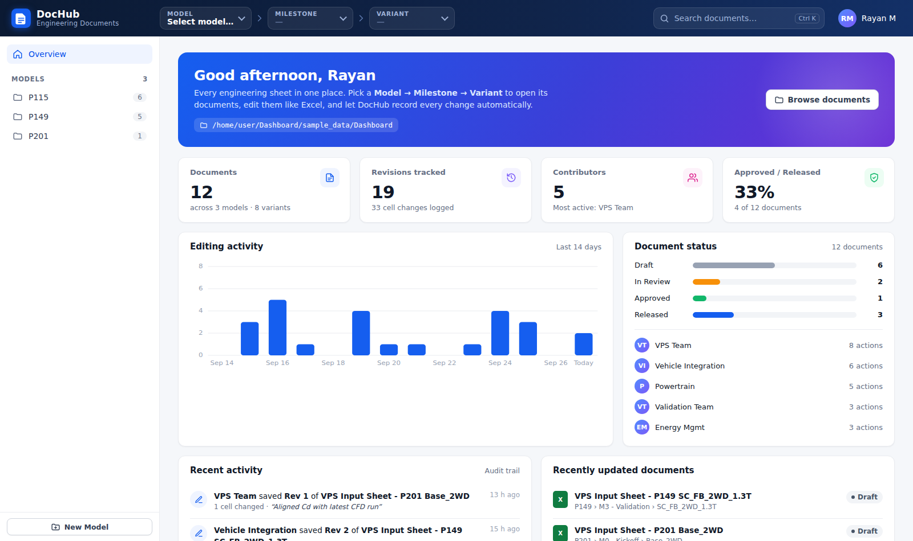
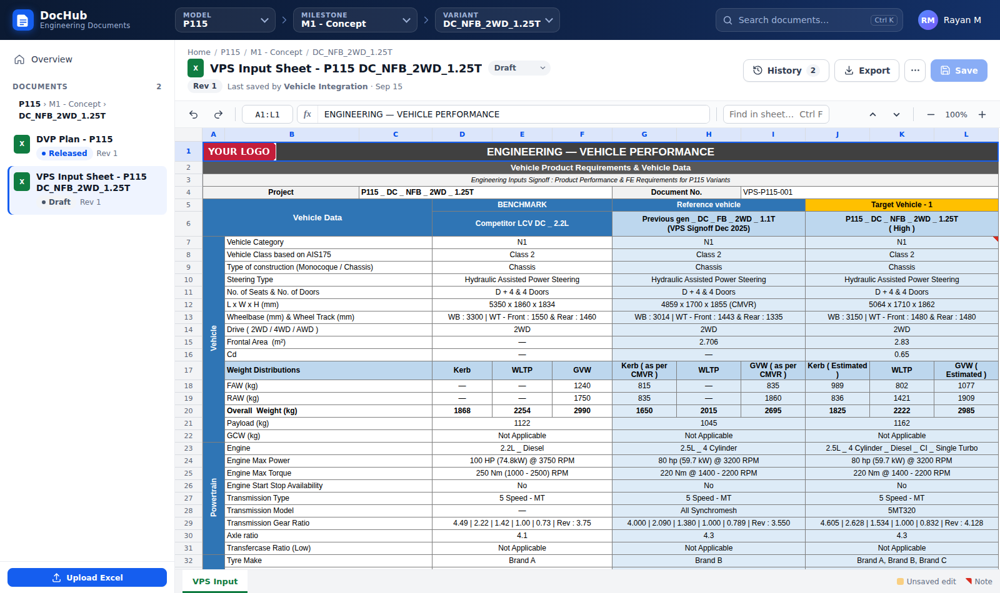
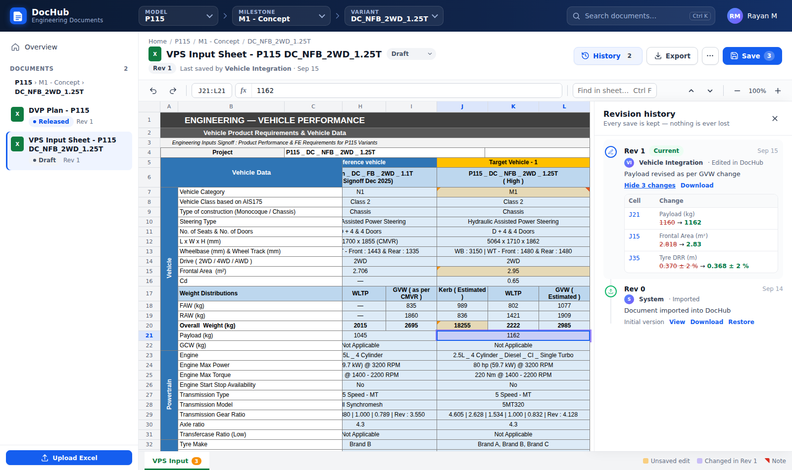

# DocHub — Engineering Document Workspace

DocHub turns a shared folder of Excel sheets into a web app. Users pick
**Model → Milestone → Variant**, open a document, and edit it in the browser. The
sheet looks like it does in Excel: the same merged cells, colours, borders,
rotated labels, logos, dropdowns and notes. DocHub records every change
automatically.






## Why (the problem it solves)

| Today (Excel on a shared drive) | With DocHub |
|---|---|
| Nobody knows who changed which value, or when | Every save records **who, when, why, and the exact cells changed (old → new)** |
| Many copies of the same file ("_v3_final_rev2.xlsx") | **One live file per document**. Older versions are kept automatically and can be restored with one click |
| Two people edit the same file and one overwrites the other | **Conflict detection**: the second person is warned and their edits are kept |
| Hard to find the right document | Model / Milestone / Variant drop-downs plus instant search (Ctrl K) |
| No overview for management | Dashboard with document count, revisions, contributors, status (Draft → In Review → Approved → Released) and a live audit trail |
| People still need the Excel file | **Export to .xlsx at any time**, with or without unsaved edits. The server file stays a normal Excel file |

## Features

- **Excel-faithful rendering**: column widths, row heights, merged cells, theme
  colours and tints, fonts, borders, wrap, text rotation, rich text (m², CO₂),
  images and logos, frozen panes, hidden rows and columns, gridlines, cell notes, and
  data-validation lists (shown as dropdown fields).
- **Excel-like editing**: type to overwrite, F2 to append, Enter / Tab / arrow keys,
  Alt+Enter for a new line, Delete, undo / redo, copy and paste (including
  multi-cell paste from Excel), formula bar, name box ("go to D12"), find
  (Ctrl F) and zoom.
- **Safe saving**: only the edited cells are rewritten inside the original
  .xlsx, so logos, signatures, charts, macros (.xlsm) and formatting are
  kept. Excel recalculates formulas when the file is opened.
- **Revision history**: a timeline of every revision. You can see its changes
  (highlighted on the sheet), open it read-only, download it, or restore it.
- **Edits made directly in Excel are detected**: if someone changes the file
  outside DocHub, the next time it is opened DocHub records an "outside edit"
  revision with a cell-by-cell diff.
- **Unsaved work is never lost**: pending edits are kept in the browser and can
  be restored after a crash or a closed tab.
- **Document management**: create Model / Milestone / Variant folders, upload
  workbooks, copy a document to another variant, and set a status.

## Folder layout

```
C:\Dashboard\
  P115\                          <- Model
    M1 - Concept\                <- Milestone
      DC_NFB_2WD_1.25T\          <- Variant
        VPS Input Sheet.xlsx     <- Documents (.xlsx / .xlsm)
  .dochub\                       <- created by DocHub: history, snapshots, audit log
```

Existing folders work as they are: point DocHub at the root and it picks them up.

## Running it (Windows)

1. Install Python 3.10+ from python.org (tick "Add python.exe to PATH").
2. Double-click **`install.bat`** (one time only).
3. Double-click **`start.bat`**. It serves `C:\Dashboard` at http://localhost:8080.
   Colleagues can open `http://<your-pc-name>:8080`.

To try it with sample documents and demo history first, run
**`start-demo.bat`**.

Command-line options:

```
python run.py --root "D:\Other\Folder" --port 9000
set DOCHUB_ROOT=\\fileserver\share\Dashboard  &&  python run.py
```

## Development

```
pip install -r requirements.txt pytest
python scripts/make_sample.py --seed-history   # sample_data/Dashboard
python run.py --dev                            # auto-reload
python -m pytest -q
```

### Architecture

| Part | File | Notes |
|---|---|---|
| Web server / REST API | `server/app.py` | Flask, served by Waitress in production |
| Excel → web model | `server/excel_reader.py` | openpyxl; resolves theme colours, borders, merges, images, validations |
| Web edits → Excel | `server/excel_writer.py` | Patches only the edited `<c>` cells in the sheet XML (lxml) |
| History & audit | `server/storage.py` | JSON revision log + full snapshot per revision under `.dochub/` |
| Front end | `static/` | Plain HTML/CSS/JS with no build step and no internet/CDN needed |

### Troubleshooting: a document does not open

1. Double-click **`check.bat`**. It tries to open every workbook under `C:\Dashboard` and
   writes a report to `dochub-check.txt`, with one line per file (OK, or the reason it fails).
2. The web page also explains the problem and offers a fix when a file cannot be opened:

| Message | What to do |
|---|---|
| **Old Excel format** (.xls / .xlsb) | Click **Convert to .xlsx**. This needs Excel on the server PC (plus `pip install pywin32`) or LibreOffice. Otherwise, open the file in Excel and use Save As → *Excel Workbook (.xlsx)*. The original file is kept. |
| **This workbook is protected** | The file is encrypted by a password or a Microsoft sensitivity label such as "Confidential – encrypted". Save a copy without encryption, or ask IT for a label that does not encrypt. |
| **The file is in use / could not be read** | Close it in Excel, or make the OneDrive folder "Always keep on this device". |

Documents are found in Variant folders, including their sub-folders, and also
directly inside Model or Milestone folders.

### Current limitations

- There is no login yet. Users type their name, which is stored in the browser.
  Windows / Active Directory sign-in is the natural next step.
- Formulas are shown with Excel's last calculated value. A cell that depends on an
  edited cell updates when the file is next opened in Excel.
- Legacy `.xls` files are listed and can be converted to `.xlsx` with one click (see above).
- Cells inside an *array formula* (entered with Ctrl+Shift+Enter) can only be changed in Excel.
- Very large sheets are shown up to 3,000 rows × 150 columns.
